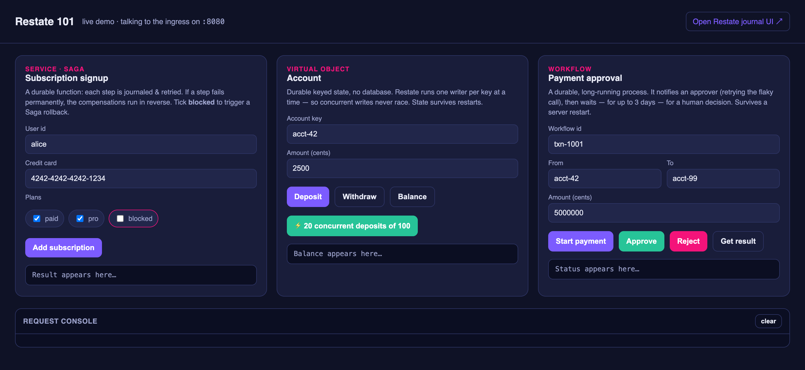

# Restate 101

A hands-on introduction to [Restate](https://restate.dev) — the durable execution
platform — built around three things:

1. **What can you build?**
2. **The building blocks** — Services, Virtual Objects, Workflows
3. **How does it work?** — why it's so reliable

It includes a slide deck, a runnable **Java** demo (one handler per building block),
and a clickable browser UI so you can drive the demo without typing curl. Everything
runs in Docker — no local installs beyond Docker required.

**📊 Slides:** [view the deck live](https://jgrier.github.io/restate-101-demo/) ·
[download the PDF](slides/restate-101.pdf)

## Quick start

Requires only **Docker**. From the repo root:

```bash
./scripts/start.sh      # build + start Restate, the Java demo, and the UI; registers the service
./scripts/stop.sh       # stop & remove containers (add --clean to also wipe state)
```

`start.sh` brings up the whole stack and opens the **demo UI** in your browser:

| What | URL |
|------|-----|
| **Demo UI** (click through the building blocks) | http://localhost:8088 |
| **Restate Web UI** (per-step journals, state) | http://localhost:9070/ui |
| Ingress (call services directly) | http://localhost:8080 |

In the UI you can: run the **Service / Saga** (tick `blocked` to trigger a rollback),
deposit/withdraw on the **Virtual Object** (incl. a 20-way concurrent test), and
start/approve the **Workflow**. A request console logs every call and its response.



> **Survives-a-restart demo:** start a workflow, run `docker compose restart restate`
> while it's parked, then approve it — it resumes from the persisted log.

## Contents

| Path | What it is |
|------|------------|
| `slides/restate-101.md` | The deck (Marp markdown). Three parts mirroring the agenda. |
| `slides/talk-track.md` | Speaker script: timings, demo choreography, Q&A prep, closing ask. |
| `demo/` | Runnable Java demo — one handler per building block (Restate Java SDK 2.8.0). |
| `demo/README.md` | Run details + the exact curl commands for each demo beat. |
| `demo-ui/` | Clickable browser UI. Zero-dep Node server on `:8088` that proxies to the ingress. |
| `docker-compose.yml` | Runs the whole stack (Restate + Java demo + UI) in Docker. |
| `scripts/start.sh` · `scripts/stop.sh` | One-command bring-up / tear-down. |

## Running without Docker

See `demo/README.md` for the manual path (install `restate-server` + a JDK 17, run
the Java service with Gradle, register it, and drive it with curl).

## Using the slides

Read them without building anything: **[live deck](https://jgrier.github.io/restate-101-demo/)**
(rendered via GitHub Pages) or the **[PDF](slides/restate-101.pdf)**.

The deck is [Marp](https://marp.app) markdown. To present or export it yourself:

The deck uses inline HTML/SVG, so always pass `--html` when rendering:

```bash
npx @marp-team/marp-cli@latest --html slides/restate-101.md             # -> HTML
npx @marp-team/marp-cli@latest --html slides/restate-101.md --pdf        # -> PDF
npx @marp-team/marp-cli@latest --html -p -s slides/                     # live preview server
```

Speaker notes live in `<!-- -->` comments on each slide (shown in Marp presenter
mode); a fuller script is in `slides/talk-track.md`.

## Notes

- Restate server is pinned in `docker-compose.yml` via `RESTATE_IMAGE`; bump it there
  to move versions. The Java SDK version is pinned in `demo/build.gradle.kts`.
- Java SDK note: there is **no `@Exclusive`** annotation — the default `@Handler` on a
  `@VirtualObject` *is* the exclusive (single-writer) handler; `@Shared` is the
  concurrent read-only one.
- The Java package is `com.example.restate101` — rename it to your own namespace if
  you fork this.
